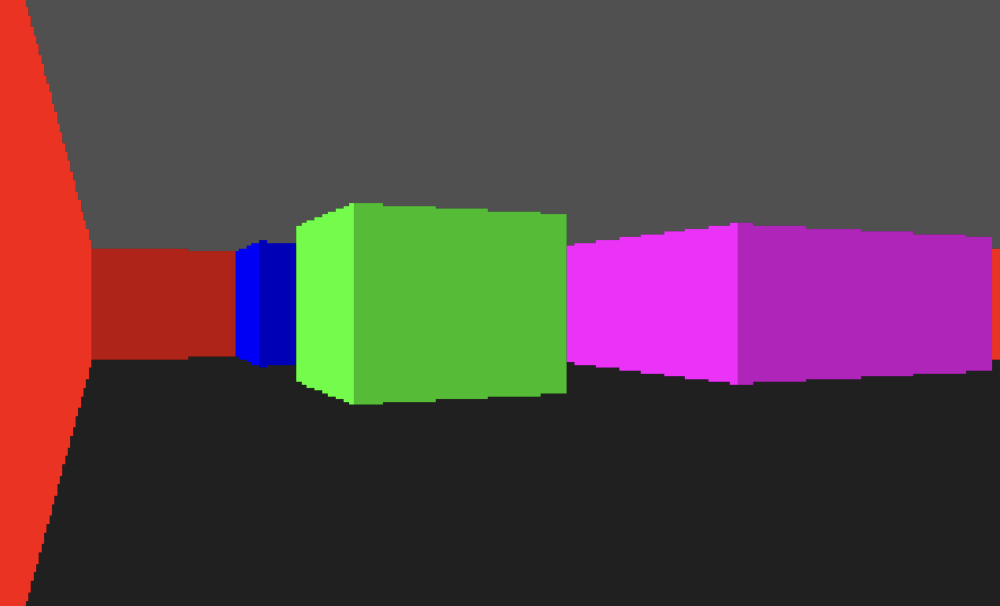

# raycasting-rs



## 💡 Overview
This project is a quick showcase of the classic Wolfenstein 3D raycasting technique built in Rust.  
It traces rays through a 2D map to determine wall heights and colors, creating a pseudo-3D view.  
The engine uses a Digital Differential Analyzer (DDA) approach to step through the map grid, detect wall hits, and compute distances.

### Inspiration
- [Youtube video by jdh](https://www.youtube.com/watch?v=fSjc8vLMg8c&t)
- [Blogpost by Lode](https://lodev.org/cgtutor/raycasting.html).

## 📦 Prerequisites
- **Rust and Cargo:** Make sure you have [Rust](https://www.rust-lang.org/tools/install) installed.
- **SDL2 Library**: This project uses [SDL2](http://www.libsdl.org) as a minimum dependency.

### Installing SDL2

#### macOS
Homebrew example:
```bash
$ brew install sdl2
```

#### Linux
Ubuntu example:
```bash
sudo apt-get install libsdl2-dev
```
Fedora example:
```bash
sudo dnf install SDL2-devel
```
Arch example:
```bash
sudo pacman -S sdl2
```

## 🚀 Building and Running
1. Clone the repository:
``` bash
$ git clone https://github.com/adrior11/raycasting-rs.git
$ cd raycasting-rs
```

2. Build and Run the application:
```bash
$ cargo build
$ cargo run
```

After starting the application, an SDL2 window should appear, showing the environment using the raycasting technique.

## ⚠️ Unsafe Usage
There's a *unsafe* block in [ver_line](https://github.com/adrior11/raycasting-rs/blob/2835983937a4578d716b6ca8a9ce7e73a0937d2d/src/modules/render.rs#L124)
to perform pointer arithmetic for writing pixel data. This provides a performance boost of around ~40% after benchmarking it.

### Code
```rust
fn ver_line(state: &mut State, x: u32, y0: i32, y1: i32, color: u32) {
    let pixels_ptr = state.pixels.as_mut_ptr();

    // Decompose the color (0xAARRGGBB) into separate bytes (ARGB8888 -> RGBA in memory).
    let a = ((color >> 24) & 0xFF) as u8;
    let r = ((color >> 16) & 0xFF) as u8;
    let g = ((color >> 8) & 0xFF) as u8;
    let b = ((color >> 0) & 0xFF) as u8;

    // Clamp the drawing range to the screen boundaries
    let y_start = y0.max(0) as usize;
    let y_end = y1.min((SCREEN_HEIGHT - 1) as i32) as usize;

    // Convert pixel index to a byte offset in the u8 buffer:
    // each pixel is 4 bytes, so multiply by 4.
    let mut offset = (y_start * SCREEN_WIDTH as usize + x as usize) * 4;
    let stride = SCREEN_WIDTH as usize * 4;

    for _ in y_start..=y_end {
        // Write precomputed channels
        unsafe {
            *pixels_ptr.add(offset + 0) = r;
            *pixels_ptr.add(offset + 1) = g;
            *pixels_ptr.add(offset + 2) = b;
            *pixels_ptr.add(offset + 3) = a;
        }

        // Move to next row
        offset += stride;
    }
}
```

## License
This project is available under the MIT License.
